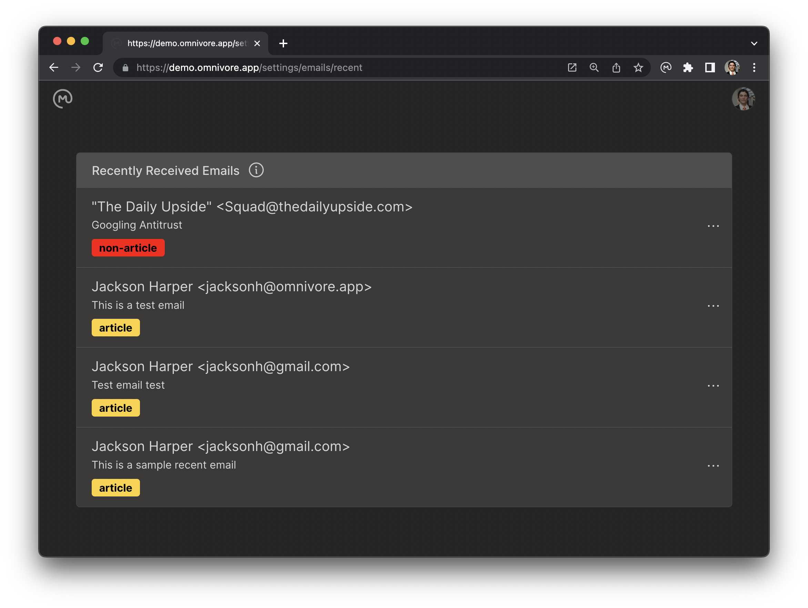

# {{ $frontmatter.title }}

Omnivore le permite crear bandejas de entrada de correo electrónico que se pueden utilizar para

[[toc]]

Una dirección de correo electrónico de Omnivore recibirá el correo electrónico, detectará si el correo electrónico es un documento PDF o un boletín y agregará el contenido a su biblioteca.

## Recibir suscripciones a boletines (newsletters) por correo electrónico

1. En el sitio web o la aplicación Omnivore, clic en su foto, inicial o avatar en la esquina superior derecha para acceder al menú de perfil. Seleccione Correos electrónicos en el menú.

2. Toque Crear una nueva dirección de correo electrónico para agregar una nueva dirección de correo electrónico (por ejemplo, nombre de usuario-123abc@inbox.omnivore.app) a la lista.

3. Haga clic en el icono Copiar junto a la dirección de correo electrónico.

4. Navegue a la página de registro del boletín al que desea suscribirse.

5. Pegue la dirección de correo electrónico de Omnivore en el formulario de registro.

6. Los nuevos boletines se enviarán automáticamente a su bandeja de entrada de Omnivore.

::: consejo Si Omnivore recibe un correo electrónico que no parece un artículo, como un mensaje de bienvenida o una nota del autor, se reenviará a la dirección de correo electrónico de su cuenta de Omnivore (el correo electrónico con el que se registró).
:::

## Envío de archivos PDF a su dirección de correo electrónico de Omnivore

Agregue archivos PDF a su biblioteca de Omnivore enviándolos a su dirección de correo electrónico de Omnivore. Si hay una línea de asunto en el correo electrónico, se utilizará como título del PDF. Si no hay una línea de asunto, el nombre del archivo se utilizará como título.

::: consejo Solo se puede manejar un solo PDF adjunto a la vez. Si desea guardar varios archivos PDF en su biblioteca, envíe cada uno en un correo electrónico por separado.
:::

## Creación de artículos en su biblioteca

Para crear un artículo en su biblioteca, envíe un correo electrónico a la dirección de su bandeja de entrada y agregue `OMNIVORE:` como prefijo al asunto de su correo electrónico. Por ejemplo `OMNIVORE: Diez consejos para usar Omnivore`. El contenido de su correo electrónico se agregará a su biblioteca y el sufijo del asunto se utilizará como título del elemento de la biblioteca.

## Problemas de depuración con su bandeja de entrada de correo electrónico

### Si no recibe un correo electrónico

Omnivore mantiene una lista de sus correos electrónicos recibidos recientemente, sin importar cómo estén clasificados. Están disponibles en la página [settings/emails/recent](https://omnivore.app/settings/emails/recent).

### Ver texto de correo electrónico

Puede usar los correos electrónicos recibidos recientemente para recuperar cosas como correos electrónicos de confirmación de suscripción. En la página de correos electrónicos recientes, busque el correo electrónico, haga clic en el botón de menú y seleccione "Ver texto". Esto abrirá el cuerpo de texto del correo electrónico.

### Mover el correo electrónico a su biblioteca

Si un correo electrónico no se clasificó correctamente como artículo, puede moverlo manualmente a su biblioteca. En la página de correos electrónicos recientes, busque el correo electrónico, haga clic en el botón de menú y seleccione `Marcar como artículo`. Esto cambiará la clasificación del artículo a `artículo` y moverá el elemento a su biblioteca.
